# Ellatech Inventory Management

A React Native (Expo + NativeWind) inventory management app that simulates user registration, product management, stock adjustment, and transaction history — all powered by local state with no backend required.

## Live Demo

> **Run the app directly in your browser or on your phone:**

| Platform | Link |
|----------|------|
| **Web App** | [https://ellatech-inventory-munir.netlify.app](https://ellatech-inventory-munir.netlify.app) |
| **Expo Dashboard** | [https://expo.dev/accounts/muay01111/projects/ellatech-inventory](https://expo.dev/accounts/muay01111/projects/ellatech-inventory) |
| **GitHub Repo** | [https://github.com/black12-ag/ellatech](https://github.com/black12-ag/ellatech) |

[](https://expo.dev/accounts/muay01111/projects/ellatech-inventory)
[](https://github.com/black12-ag/ellatech)

---

## Features

| Feature | Description |
|---------|-------------|
| **Register a User** | Capture email and full name with validation |
| **Register a Product** | Capture SKU, name, price, and quantity with duplicate-SKU prevention |
| **Adjust Product Stock** | Add or remove quantity — stock cannot go negative |
| **View Product Status** | Display SKU, quantity, price, and last updated time |
| **Transaction History** | List all stock changes with simple "Load More" pagination |

---

## Architecture


### State Flow


### Navigation

```mermaid
graph LR
    TabBar --> Home[🏠 Dashboard]
    TabBar --> Products[📦 Products]
    TabBar --> History[📋 Transactions]
    TabBar --> Profile[👤 Profile]

    Products --> PList[Product List]
    Products --> PAdd[Add Product]
    Products --> PDetail[Product Detail + Adjust]
```



---

## Tech Stack

| Technology | Purpose |
|-----------|---------|
| React Native | Cross-platform mobile framework |
| Expo SDK 52 | Managed workflow, fast development |
| NativeWind v4 | Tailwind CSS utility classes for RN |
| TypeScript | Type-safe development |
| React Context | Lightweight state management via hooks |

---

## Getting Started

### Prerequisites

- Node.js 18+
- npm or yarn

### Installation

```bash
git clone https://github.com/black12-ag/ellatech.git
cd ellatech
npm install
```

### Run the App

```bash
# Start Expo dev server
npm start

# Web only
npm run web

# iOS simulator
npm run ios

# Android emulator
npm run android
```

---

## Project Structure

```
.
├── App.tsx                             # Root — imports CSS, wraps in AppProvider
├── global.css                          # Tailwind directives
├── tailwind.config.js                  # NativeWind + Tailwind config
├── babel.config.js                     # Babel with NativeWind preset
├── metro.config.js                     # Metro with NativeWind wrapper
├── app.json                            # Expo configuration
│
└── src/
    ├── types/
    │   └── index.ts                    # User, Product, Transaction interfaces
    ├── context/
    │   └── AppContext.tsx               # Global state provider
    ├── navigation/
    │   └── AppNavigator.tsx            # Tab bar + screen routing
    └── screens/
        ├── Register/
        │   └── RegisterScreen.tsx      # User registration form
        ├── Dashboard/
        │   └── DashboardScreen.tsx     # Stats overview + quick actions
        ├── Products/
        │   ├── ProductListScreen.tsx   # Searchable product list
        │   ├── AddProductScreen.tsx    # New product form
        │   └── ProductDetailScreen.tsx # Status view + stock adjustment
        ├── Transactions/
        │   └── TransactionHistoryScreen.tsx  # Paginated history
        └── Profile/
            └── ProfileScreen.tsx       # User info + logout
```

---

## Approach & Trade-offs

### Design Decisions

1. **NativeWind over StyleSheet** — All styling uses Tailwind utility classes via NativeWind for consistency and speed, as required by the exercise.

2. **React Context over Redux/Zustand** — A single `AppContext` with `useState` / `useCallback` hooks. For a simulation app with no backend, this is the right level of complexity.

3. **Custom Tab Navigation** — A lightweight custom tab bar using state instead of the full `@react-navigation` library. This reduces bundle size and makes every navigation action a transparent state change.

4. **In-Memory State** — All data lives in React state (no AsyncStorage). Data resets on reload, which is appropriate for "simulating API behaviour with local state."

5. **Atomic File Structure** — Every screen gets its own folder. Context, types, and navigation are separated cleanly. No file exceeds 200 lines.

### What I Would Improve With More Time

- **Persistent Storage** — AsyncStorage to retain data across sessions
- **Animations** — Reanimated transitions between screens and list items
- **Unit Tests** — Jest tests for AppContext logic (addProduct, adjustStock validation)
- **Form Library** — react-hook-form for more robust form handling
- **Dark Mode** — Via NativeWind's `dark:` prefix
- **Accessibility** — Proper `accessibilityLabel` and `accessibilityRole` props throughout

---

## Validation & Error Handling

| Action | Validation |
|--------|-----------|
| Register User | Email must contain `@`, name must be 2+ characters |
| Add Product | All fields required, price > 0, quantity >= 0, SKU must be unique |
| Adjust Stock | Quantity must be > 0, stock cannot go below 0 |
| All Actions | Error messages inline, success alerts on completion |

---

## License

Built for the Ellatech Frontend Take-Home Exercise.
